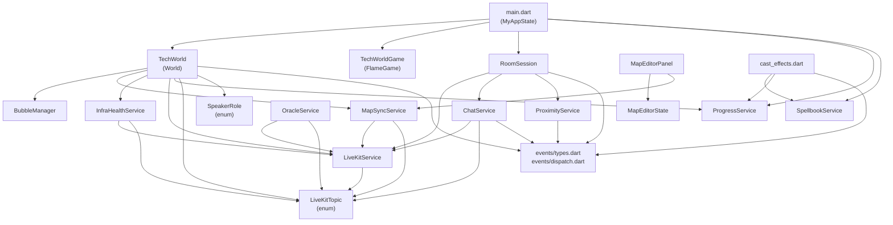
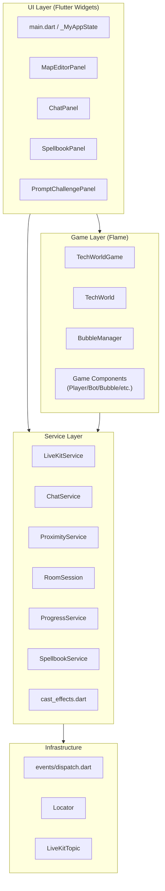
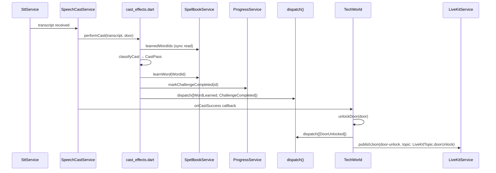

# Tech World — Architecture

> Describes the architecture **as it is now** (post architecture-sweep refactor).
> Generated by `/tw-architecture-sweep`.

## Overview

Tech World is a Flutter/Flame multiplayer educational game. Players solve coding challenges together in a 2D game world, with real-time communication (positions, video bubbles, chat, AI tutor) over LiveKit. There is no separate game server — all network traffic flows through a LiveKit SFU.

The architecture has three main strengths:
1. **Event-sink pipeline** — business functions return `(Result, List<AppEvent>)` records; `dispatch()` fans to sinks; sinks are registered at startup. The boundary is clean.
2. **Deep modules** — `BubbleManager`, `LiveKitService`, `RoomSession`, `TileFloorComponent`, `PathComponent` hide significant complexity behind narrow interfaces.
3. **Typed data-channel topics** — `LiveKitTopic` enum (added in this sweep) gives exhaustive routing for all 26 LiveKit data-channel topics, replacing scattered string literals.

---

## Module Dependency Graph

---

## Flame Component Tree

```mermaid
graph TD
    G["TechWorldGame\n(FlameGame)"]
    W["TechWorld\n(World)\nTapCallbacks"]
    SC["SnapshotComponent"]
    CAM["Camera"]
    PC["PathComponent\n(HasWorldReference)"]
    PL["PlayerComponent\n(SpriteAnimationGroup\nKeyboardHandler)"]
    BC["BarriersComponent\n(HasWorldReference)"]
    TC["TerminalComponent[]\n(TapCallbacks)"]
    DC["DoorComponent[]"]
    TF["TileFloorComponent"]
    TO["TileObjectLayerComponent"]
    BOT["BotCharacterComponent[]"]
    DF["DreamfinderComponent"]
    MP["MapPreviewComponent"]
    SBC["SpeechBubbleComponent[]"]
    VBC["VideoBubbleComponent[]"]
    PBC["PlayerBubbleComponent[]"]
    BBC["BotBubbleComponent[]"]
    BFC["BubbleFieldComponent"]
    MVC["MergedVideoBubbleComponent"]

    G --> W
    G --> SC
    G --> CAM
    W --> PC
    W --> PL
    W --> BC
    W --> TC
    W --> DC
    W --> TF
    W --> TO
    W --> BOT
    W --> DF
    W --> MP
    W --> SBC
    W --> VBC
    W --> PBC
    W --> BBC
    W --> BFC
    W --> MVC
```

**Max depth: 3** (Game → World → Component). No runaway nesting. Primary tree concern is TechWorld's fan-out (~15 direct child types), not depth.

---

## Layer Diagram

---

## Data Flow: Player Casts a Spell at a Door

---

## Module Table

| Module | Interface | Impl (LOC) | Depth | Issues |
|--------|-----------|------------|-------|--------|
| `TechWorld` (flame/tech_world.dart) | 22 public methods/notifiers | 1570 | 2 | GOD WORLD — 15+ direct child types. `progressService` now injected (not via Locator). LiveKit topics use enum. |
| `main.dart` / `_MyAppState` | 12 private methods, ~20 fields | 1690 | — | GOD STATE — orchestrates auth, room join/leave, challenge submission. Sets `techWorld.progressService` on sign-in. |
| `BubbleManager` | 12 public methods | 754 | — | DEEP MODULE. `_opacityForDistance` moved here from ProximityService (presentation concern). |
| `LiveKitService` | 20 public methods/streams | 889 | — | DEEP MODULE. All topics use `LiveKitTopic.*.wire`. `publishJson` still public (callers build payloads). |
| `ChatService` | ~10 public methods | 897 | — | SLIGHTLY GOD. TTS and `botStatusNotifier` side-effects remain. All topics use `LiveKitTopic.*.wire`. |
| `RoomSession` | 4 public methods | 311 | — | DEEP MODULE. Reconnection path tested. |
| `MapEditorState` | ~35 public methods | 911 | — | ACCEPTABLE — CRDT editor scope. |
| `MapSyncService` | 5 public methods | 965 | — | MIXED CONCERNS. All topics use `LiveKitTopic.*.wire`. |
| `ProximityService` | 3 public methods | 110 | — | SHALLOW. `calculateOpacity` removed (moved to `BubbleManager._opacityForDistance`). |
| `ProgressService` | 4 public methods | 87 | — | DEEP MODULE. Clean. |
| `SpellbookService` | 4 public methods | 139 | — | DEEP MODULE. Clean. |
| `OracleService` | 2 public methods | 164 | — | ACCEPTABLE. Topics use `LiveKitTopic.*.wire`. |
| `SpeechCastService` | 3 public methods | 77 | — | DEEP MODULE. Clean. |
| `cast_effects.dart` | 2 pure functions + `performCast` | 127 | — | DEEP MODULE. Two-function split (pure/effectful) well-reasoned. |
| `InfraHealthService` | 2 public methods | 115 | — | ACCEPTABLE. Topics use `LiveKitTopic.*.wire`. |
| `MapEditorPanel` | 1 public widget | 1268 | — | LARGE WIDGET. `syncService` now injected via constructor parameter (no more `Locator.maybeLocate<MapSyncService>()` inside widget). |
| `events/dispatch.dart` | 3 public functions | 49 | — | DEEP MODULE. Clean. |
| `events/types.dart` | 34 sealed types | 785 | — | WIDE DATA. All 34 event types in one file. Correct. |
| `LiveKitTopic` | enum (26 values) | 70 | — | NEW. Closed set of all data-channel topic wire strings. |
| `SpeakerRole` | enum (2 values) | 22 | — | NEW. Replaces `'dreamfinder'`/`'user'` string literals in `_handleSpeechTranscript`. |
| `Locator` | 4 static methods | 68 | — | SHALLOW INFRASTRUCTURE. No lifecycle, flat map. `maybeLocate<MapSyncService>()` call moved from widget to main.dart. |

---

## Remaining Issues

The following refactors from the original assessment were skipped as [M] or [L] complexity:

### [M] Extract `TechWorld` LiveKit-subscription block into `LiveKitGameBridge`
The 13 stream subscriptions in `connectToLiveKit()` (lines ~620–831) form a coherent unit translating LiveKit events into game mutations. Extract to a plain Dart class `LiveKitGameBridge` with callbacks. Makes subscription lifecycle explicit and testable without full Flame game. **Effort: 200–300 lines, high test value.**

### [M] Eliminate global `botStatusNotifier`
`botStatusNotifier` (in `bot_status.dart`) is written by `ChatService`, `RoomSession`, and `main.dart`, and read globally. Replace with `ChatService.botStatus` as a `ValueListenable<BotStatus>` getter. **Effort: ~50 lines changed across 5 files, removes global mutable state.**

### [M] Extract code-challenge submission side-effects from `main.dart` into `cast_effects.dart`
Lines 1226–1270 of `main.dart` duplicate the `applyCastSuccessEffects` pattern. Add `applyCodeSubmitEffects(...)` to `cast_effects.dart`. **Effort: ~80 lines, eliminates duplication.**

### [L] Decompose `TechWorld`
After the [M] refactors above, extract `MapLoader` and `DoorManager` as sub-systems. TechWorld becomes a thin coordinator. **Effort: 400+ lines, very high value for long-term maintainability.**
