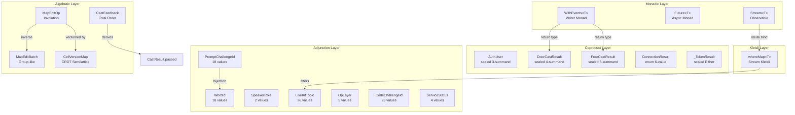

# Categorical Structure of Tech World

This document maps the categorical structures present in the Tech World
Flutter/Dart/Flame codebase, records which laws are tested, and explains
how the structures relate to each other.

## Structure Relationships

## Categorical Inventory

### 1. Writer Monad: `WithEvents<T>`
- **What**: `typedef WithEvents<T> = (T, List<AppEvent>)` -- a Writer
  monad where the monoid is `List<AppEvent>` under concatenation.
- **Where**: `lib/events/types.dart:5`
- **Laws tested**: Left unit, right unit, associativity, event
  accumulation, monoid identity, monoid associativity
- **Test file**: `test/categorical/writer_monad_test.dart` (6 tests)

### 2. Sealed Coproducts

#### AuthUser (3 summands)
- **What**: `sealed class AuthUser implements User` with `SignedInUser | SignedOutUser | PlaceholderUser`
- **Where**: `lib/auth/auth_user.dart`
- **Laws tested**: Construction, exhaustive switch, disjointness, User interface
- **Test file**: `test/categorical/sealed_coproduct_test.dart`
- **Fix applied**: Changed from `abstract class` to `sealed class`;
  renamed concrete authenticated variant to `SignedInUser`. Extracted
  `User` as an `abstract interface class` so Flame components
  (`PlayerComponent`, `DreamfinderComponent`) can still implement it
  without being part of the sealed auth hierarchy.

#### DoorCastResult (4 summands)
- **What**: `sealed class DoorCastResult` with `CastPass | DoorCastNoMatch | DoorCastNotLearned | CastWrongDoor`
- **Where**: `lib/spellbook/door_cast_result.dart`
- **Laws tested**: All 4 summands constructible, exhaustive switch
- **Test file**: `test/categorical/sealed_coproduct_test.dart`

#### FreeCastResult (5 summands)
- **What**: `sealed class FreeCastResult` with `FreeCastNoMatch | FreeCastNotLearned | CastComboKnown | CastComboKnownPartial | CastComboNovel`
- **Where**: `lib/spellbook/free_cast_result.dart`
- **Laws tested**: Construction, unmodifiable list invariant on CastComboNovel
- **Test file**: `test/categorical/sealed_coproduct_test.dart`

#### _TokenResult (sealed Either)
- **What**: `sealed class _TokenResult` with `_TokenSuccess(token) | _TokenFailure(reason)`
- **Where**: `lib/livekit/livekit_service.dart`
- **Fix applied**: Replaced class with nullable token + always-present
  connectionResult. The illegal state `(token: null, result: connected)` is
  no longer representable.

### 3. Free-Forgetful Adjunctions (Enhanced Enums)

Each enhanced enum has:
- **Forgetful functor**: `Enum -> String` via `.wire` / `.wireName` / `.name`
- **Free functor**: `String -> Enum?` via `.tryParse` / `.parse` / `.fromString`
- **Adjunction unit**: `parse(x.wire) == x` for all x

| Enum | Values | Wire field | Parse method | Test file |
|------|--------|-----------|--------------|-----------|
| `LiveKitTopic` | 26 | `.wire` | `tryParse` | `round_trip_test.dart` |
| `SpeakerRole` | 2 | `.wire` | `tryParse` | `round_trip_test.dart` |
| `WordId` | 18 | `.name` | `parse` | `round_trip_test.dart` |
| `OpLayer` | 5 | `.name` | `tryParse` | `round_trip_test.dart` |
| `PromptChallengeId` | 18 | `.wireName` | `parse` | `round_trip_test.dart` |
| `CodeChallengeId` | 23 | `.wireName` | `parse` | `round_trip_test.dart` |
| `ServiceStatus` | 4 | `.name` | `fromString` | `round_trip_test.dart` |

All 7 enums have complete round-trip coverage (96 value-level tests +
7 nonsense/null rejection tests).

### 4. CRDT Join-Semilattice: `CellVersionMap`
- **What**: Last-Writer-Wins register with `merge = max(counter, playerId)`
- **Where**: `lib/map_editor/crdt/cell_version_map.dart`
- **Laws tested**: Commutativity, associativity, idempotence,
  convergence (all 6 permutations of 3 ops), toJson/loadFromJson round-trip
- **Test file**: `test/categorical/crdt_monoid_test.dart` (7 tests)

### 5. MapEditOp Involution
- **What**: `inverse` swaps `oldValue` and `newValue`; `inverse(inverse(op))` recovers the original payload
- **Where**: `lib/map_editor/crdt/map_edit_op.dart:61`
- **Laws tested**: Double-inverse recovery, swap correctness,
  null-value symmetry, counter freshness, batch inverse order reversal,
  toJson/fromJson round-trip
- **Test file**: `test/categorical/involution_test.dart` (7 tests)

### 6. Stream Kleisli: `.whereMap<T>`
- **What**: `Stream<S>.whereMap<T>(S -> T?)` -- Kleisli bind for the
  Maybe monad lifted to Stream
- **Where**: `lib/utils/stream_extensions.dart`
- **Laws tested**: Null filtering, identity, composition, type narrowing, empty stream
- **Test file**: `test/categorical/stream_extension_test.dart` (6 tests)
- **Fix applied**: Extracted from 5 repetitions of
  `.map(...).where(!=null).cast<T>()` in `LiveKitService`.

### 7. CastResult Retraction
- **What**: `CastResult.passed` is now derived from
  `feedback == CastFeedback.resonates` -- the boolean is a retract of the enum
- **Where**: `lib/prompt/cast_result.dart`
- **Laws tested**: All 4 feedback values map correctly, old constructor
  parameter is ignored, judgeReasoning preserved
- **Test file**: `test/categorical/cast_result_derived_test.dart` (7 tests)
- **Fix applied**: Changed `passed` from a stored field to a derived getter.

### 8. Structures Already Correct (No Changes Made)

These structures were already aligned with their categorical shape.
The audit confirmed correctness; no fixes or tests beyond what already
exists were needed.

- **`dispatch(List<AppEvent>)`** -- Writer monad's `tell`, fan-out to sinks
- **`consoleSink` exhaustive switch** -- coproduct elimination
- **`classifyCast`** -- pure morphism in the functions category
- **`WireStates`** -- product of 5 independent FSMs
- **`walkStateFromDirection`** -- functor between enum categories
- **`directionFromTuple`** -- partial isomorphism
- **Flame Component tree** -- Rose tree (comonad not exploitable via Flame API)

## Connections Between Structures

1. **Writer + Coproduct = typed event pipeline.**
   `performCast` returns `WithEvents<DoorCastResult>`. The consumer
   switches on the `DoorCastResult` (coproduct elimination) while the
   event list flows to `dispatch` (monad's tell). Writer distributes
   over coproducts -- you can tell events regardless of which branch
   the result took.

2. **Adjunction chains = serialization pipeline.**
   `RoomData.fromFirestore` composes several adjunction units:
   `DocumentSnapshot -> Map -> GameMap`. Each step is the counit of a
   parse-serialize adjunction. The chain is a composition of right
   adjoints.

3. **Stream Kleisli = derived streams.**
   The 5 derived streams in `LiveKitService` (position, heartbeat,
   mapSwitch, avatar, plus mapInfoRequested which filters only) are
   now explicit Kleisli arrows via `.whereMap`. Each
   `DataChannelMessage -> T?` function is a Kleisli arrow in the
   Maybe-Stream composition.

4. **State machines as categories.**
   `_ConnectionState`, `BotStatus`, `WireStatus`, `_MicState`,
   `DreamfinderState`, `ServiceStatus` are finite categories. Some
   are total orders (ServiceStatus: up > warn > down > unknown), some
   are partial orders.

5. **CastFeedback retracts to bool.**
   The 4-value total order retracts to `{pass, fail}` via the section
   `resonates -> true, _ -> false`. The retraction is now the canonical
   definition of `CastResult.passed`.

## Law Test Coverage

| Test File | Structure | Laws | Count |
|-----------|-----------|------|-------|
| `writer_monad_test.dart` | WithEvents<T> | L-unit, R-unit, assoc, accum, M-id, M-assoc | 6 |
| `round_trip_test.dart` | 7 enhanced enums | Round-trip, nonsense rejection | 103 |
| `crdt_monoid_test.dart` | CellVersionMap | Comm, assoc, idemp, convergence, round-trip | 7 |
| `sealed_coproduct_test.dart` | AuthUser, DoorCastResult, FreeCastResult | Construction, exhaustive, disjoint | 10 |
| `involution_test.dart` | MapEditOp, MapEditBatch | Double-inverse, swap, batch reverse, round-trip | 7 |
| `stream_extension_test.dart` | .whereMap | Null filter, identity, compose, types, empty | 6 |
| `cast_result_derived_test.dart` | CastResult.passed | All feedback values, backward compat, reasoning | 7 |
| **Total** | | | **146** |

Note: 150 total test cases including parameterized sub-tests across
7 enum value sets (96 value-level round-trip tests).

## What Category Theory Can't Tell You Here

1. **Flame Component lifecycle** -- the tree is a Rose tree (comonad)
   but wrapping it in comonadic abstractions would fight the imperative
   API for zero benefit.

2. **LiveKit protocol semantics** -- category theory verifies the
   parse/wire adjunctions but cannot determine whether `reliable: false`
   for position updates is the right latency tradeoff.

3. **CRDT choice** -- the LWW semilattice laws are verified, but
   whether LWW is the right CRDT (vs. operation-based with causal
   ordering) is a domain question about conflict resolution UX.

4. **Game design** -- the "world is the listener" pattern has a
   categorical description (Store comonad applied to a listener set)
   but category theory doesn't determine whether proximity-based
   listening is more fun than button-based casting.

5. **Performance** -- stream pipelines could theoretically be fused via
   Yoneda, but Dart streams are push-based and already fuse through
   lazy subscription.

6. **Error handling** -- `try/catch` with log-and-swallow is the Maybe
   monad applied to IO, but category theory doesn't decide which errors
   to swallow.
