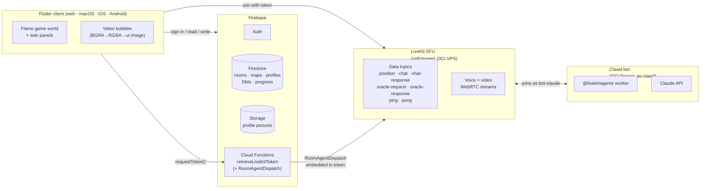
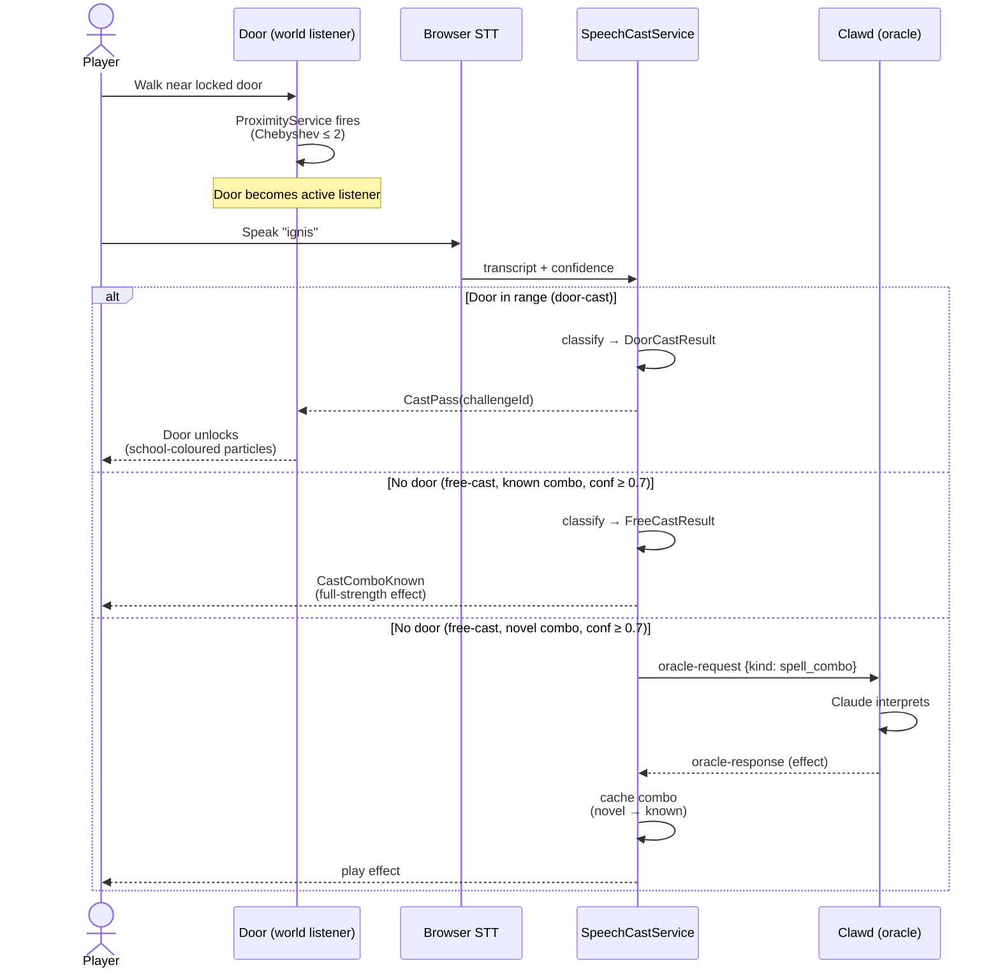

# Tech World

An educational multiplayer 2D virtual world where players solve coding challenges together. Built with Flutter and the Flame game engine, Tech World combines real-time collaboration, proximity-based video chat, an AI tutor (Clawd), and an in-game code editor to create an engaging learn-to-code experience.

## Features

### Multiplayer & Social
- **Room browser / lobby** — Browse and join public rooms or create your own, with animated join progress and owner/editor permissions
- **Player-to-player DMs** — Private direct messages delivered via targeted LiveKit data channels and persisted to Firestore
- **Proximity-based video chat** — LiveKit video/audio streams rendered as in-game bubbles. Proximity is computed with Chebyshev distance (max of |Δx|, |Δy|) so diagonals count the same as cardinals; default threshold is 3 grid squares
- **Dreamfinder presence** — An optional embodied AI participant rendered as a Three.js avatar in an iframe. The iframe canvas is captured per-frame, decoded via `decodeImageFromPixels`, and drawn into the Flame world as a video bubble — same pipeline as remote players
- **Silence Dreamfinder** — Toolbar button (speaker icon, top-right) that toggles whether the local client receives DF's audio track. Server-side disable via `RemoteTrackPublication.disable()` — DF keeps speaking in the room and other players still hear, but the SFU stops forwarding DF audio to you. Survives DF rejoin / republish via the `TrackSubscribedEvent` hook
- **Reduce motion & avatar-only modes** — User preferences (`lib/preferences/user_preferences.dart`) that disable purely decorative bubble animation (breathing scale, glow pulse, voice ripples, metaball merge animation) or hide video bubbles entirely in favour of avatar tiles. Both apply at next room entry; gameplay-essential animation (avatar walk, bubble physics, camera) is unaffected
- **User profiles** — Set a display name and upload a profile picture, stored in Firestore and Firebase Storage

### Game World
- **6 predefined maps** — Open Arena, The L-Room, Four Corners, Simple Maze, The Library, The Workshop — with runtime switching
- **Animated tiles** — Water and other terrain tiles animate via shared tickers while static tiles stay in a cached `Picture`
- **Wall occlusion** — Characters walk behind walls and object tiles using y-priority sprite overlays
- **Cross-platform** — macOS, web, iOS, Android

### Map Editor
- **Paint custom maps** — Place tiles on a 50×50 grid with layer-aware palette (floor, structure, objects)
- **Auto-barriers** — Painting solid object tiles automatically places movement barriers
- **Automapping rules engine** — Declarative rules auto-place decorative tiles (shadows, transitions) based on neighbors
- **TMX import** — Import maps from the Tiled map editor (`.tmx` format)
- **Save / load / delete** — Persist custom maps to Firestore, browse them in the lobby
- **Procedural generation** — Generate maps using BSP dungeon, recursive-backtracker maze, or cellular-automata cave algorithms

### Spellbook & Voice Casting
- **18 words of power** — A closed vocabulary of spells (`lumen`, `ignis`, `tempus`, `oraculum` …) that players speak aloud or type to interact with the game world. Each word maps 1:1 to a prompt challenge — solving the challenge teaches the word, after which it's freely reusable
- **Voice spellcasting** — Browser Speech-to-Text captures speech; a `{known, novel} × {high, low}` confidence lattice classifies each cast (table below); doors open, effects fire, or the oracle is invoked depending on the result. Web only
- **Wizard's Tower locked doors** — Doors carry a `requiredWords` list; speaking the word(s) within proximity unlocks them. The new "world is the listener" model treats the door as the active listener — the player has no casting button to press
- **Spell algebra** — Multiple words combine into compound spells. Order-independent canonical `ComboKey` (sorted, comma-joined wire names — `ignis,lumen` and `lumen,ignis` collapse to the same key). 25+ predefined combinations; novel combos route to Clawd for interpretation and are cached
- **Sealed result types** — `DoorCastResult` (door context) and `FreeCastResult` (no door context) are disjoint sealed hierarchies. The compiler proves routing correctness — the door overlay can't be handed a `CastComboNovel`, the free-cast UI can't be handed a `CastWrongDoor`

### Coding & AI
- **23 coding challenges** — Beginner (10), Intermediate (7), and Advanced (6) tiers with LSP-powered code completion and hover docs, powered by [`code_forge_web`](https://github.com/nickmeinhold/code_forge_web) — a custom Flutter web code editor with [`re_highlight`](https://pub.dev/packages/re_highlight) syntax highlighting
- **AI tutor (Clawd)** — Claude-powered bot that reviews code, answers questions, and serves as the game's spell oracle — interpreting cast intent and routing novel combinations
- **Oracle channel** — Generic `oracle-request` / `oracle-response` LiveKit topics with a `kind` discriminator; spell interpretation and future AI features share the same channel

## Prerequisites

- Flutter SDK ^3.6.0
- Firebase project configured (Auth, Firestore, Storage, Cloud Functions)

## Setup

1. Install dependencies:

   ```bash
   flutter pub get
   ```

2. Create Firebase configuration at `lib/firebase/firebase_config.dart`:

   ```dart
   const firebaseWebApiKey = '<your_web_api_key>';
   const firebaseProjectId = '<your_project_id>';
   ```

3. Configure Firebase options via FlutterFire CLI or manually create `lib/firebase_options.dart`.

## Running

Targets: macOS, web (Chrome), iOS, Android. `flutter run -d <target>`. That's the easy bit.

```bash
flutter run -d chrome   # fast dev loop, WASM/CanvasKit
flutter run -d macos    # native, FFI shared-memory video pipeline
flutter run -d ios      # see "Mobile: where the dragons live" below
flutter run -d android  # see "Mobile: where the dragons live" below
```

The interesting part isn't running it — it's understanding why it sometimes doesn't, and why the failure modes you'll hit on mobile look nothing like the failure modes you'll hit on the desktop. Most of the rest of this README is that story.

---

## Mobile: where the dragons live

Tech World is a real-time multiplayer game with proximity-based audio and video. That sentence is doing a lot of work on a phone. The phone — both iOS and Android — is a fortress designed by an OS vendor who is, broadly, suspicious of you. Tech World is a peer-to-peer game built on top of WebRTC, an open standard whose Apple and Google implementations are political documents as much as engineering ones. Most of the friction below comes from the gap between what the game wants to do and what the platform is willing to let it do.

If you're new to Flutter on mobile, the framework itself isn't the hard bit. The hard bit is the surface area underneath — the media pipeline, the network stack, the lifecycle, the permission model — and that surface area is where this project's bugs have lived.

### iOS

**WebRTC on Apple's platform is a managed relationship.** Apple ships WebKit, which has a partial and historically grumpy WebRTC implementation in Safari/WKWebView. We don't use that — we use the native LiveKit iOS SDK, which wraps Google's libwebrtc. That means we're shipping a C++ media stack into our Flutter binary via CocoaPods. When `pod install` is unhappy, it's usually because libwebrtc's prebuilt artefact didn't survive the journey from CDN to your laptop; nuking `ios/Pods/` and `ios/Podfile.lock` and re-resolving is the usual cure. The cost is six minutes of your life. Pay it.

**Camera and microphone permissions are runtime, not static.** Your `Info.plist` declares the *reason strings* the OS shows to the user — that's why `NSCameraUsageDescription` and `NSMicrophoneUsageDescription` are in the manifest. The OS still pops the modal the first time you call `setMicrophoneEnabled(true)`. If the user taps Don't Allow, you don't get a thrown exception — you get a silent permission denial and `MediaStreamTrack.enabled` quietly returns false. The proximity bubble renders black. The mic is dead. There's no banner. You can ask again, but only by sending the user to Settings → Tech World → Microphone, because the OS treats your second request as nag-spam. Build a UX path for this or live with the silent failure.

**The simulator is a beautiful lie.** It does not have a camera. It does not have a microphone. LiveKit publishes black frames and silence and the game looks broken in a way that's actually correct behaviour. The first time you see `getStats()` report `bytesReceived: 0` on the simulator, you'll spend an hour debugging — don't. Test media on a physical device. The simulator is great for everything else: UI, navigation, Firestore reads, LiveKit data-channel messages, the Flame world.

**ReplayKit is a separate app.** iOS screen capture works through ReplayKit, which requires a *broadcast extension target* — an entirely separate app bundle that runs in its own sandboxed process when the user starts a screen share. The main app communicates with the extension via App Groups (a shared UserDefaults). This repo wires the method channel side (`lib/livekit/method_channels/replay_kit_channel.dart`) but the broadcast extension target itself isn't here yet. Until it is, screen sharing on iOS is a stub that compiles and silently does nothing. You'll know you've gone down this rabbit hole when you start reading the LiveKit iOS SDK's `ScreenCaptureSampleHandler` source code at 11pm on a Tuesday.

**Background = death.** Without the VoIP entitlement and a PushKit subscription, backgrounding the app suspends the WebRTC engine. The LiveKit connection times out somewhere between 10 and 30 seconds, depending on what mood iOS is in. The user comes back from checking Instagram to find they've been teleported to the lobby. Adding the entitlement is an Apple-approval-required process for non-VoIP apps — you can't just tick a box in Xcode. For an educational game where the user is meant to be looking at the screen anyway, this is acceptable. Flag it if your use case differs.

**Apple Sign-In isn't optional if you offer Google.** The App Store guideline (§4.8) says: if you offer any third-party sign-in, you must also offer Sign in with Apple. Auth currently flows through email-link and Google. If you ever try to ship to TestFlight as more than a single internal build, this rule will eat you. The wiring lives in `lib/auth/auth_service.dart`; the Xcode-side capability lives in Signing & Capabilities → +Capability → Sign in with Apple. Plan an afternoon.

**arm64 simulators are not arm64 devices.** Since Apple Silicon, both Macs and iPhones are arm64, but they are *different* arm64. The simulator runs binaries with `Mach-O CPU subtype arm64`; the device runs `arm64e` with pointer authentication. Plugins that ship a prebuilt static library sometimes ship only one. If `flutter run -d <iphone>` fails with "binary is built for iOS simulator" or vice versa, that's the conflict. The Podfile's `EXCLUDED_ARCHS[sdk=iphonesimulator*]` line is where it gets resolved, and the Flutter team has churned this line through ~five iterations over the last three years. Keep it the way it is.

### Android

**Doze mode is the silent killer.** Android suspends background apps aggressively. Screen off + plugged in = the system enters Doze, which freezes your network stack for up to fifteen minutes between maintenance windows. WebRTC's ICE keepalives fall over. By the time the user un-Dozes the phone, the LiveKit session is dead and so is the room. `RoomSession`'s exponential backoff (2s / 4s / 8s) catches a freshly-broken connection but it doesn't catch a fifteen-minute-old one — those go to the dead-connection handler. The right architecture for a real call app is a foreground service with a persistent notification, exempt from Doze. We don't have that. Acceptable for the meetup use case (you're in the app); not acceptable for a long-running session app. If you ever take the game past the educational scope, build the service.

**Cellular NAT is a different animal.** WebRTC's peer-to-peer dream relies on STUN and TURN to discover and relay through NATs. Most home WiFi NATs are *full-cone* — once you've punched a hole, anyone can send through it. Most cellular carriers in Australia (Telstra and Optus, in particular) are *symmetric NAT* — the hole only lets through traffic from the exact IP:port you opened it to. Symmetric NAT can't do hole-punching, so the only path that works is TURN relay over TCP/443. There's a known issue tracked in project memory as `phone browser TURN failure` — phone-browser users (not phone native, *phone browser*) sometimes can't negotiate WebRTC even when the same physical phone on the same carrier can do it in the native client. The native client falls back to TURN/TCP more aggressively than mobile Safari/Chrome do. If you find yourself debugging this, `pc.getStats()` is your oracle — `selectedCandidatePair.transportType` will tell you whether you're on UDP, TCP, or TLS, and `bytesReceived` is the ground truth of whether anything is actually flowing.

**Audio focus and the Bluetooth ballet.** Android's `AudioManager` is a finite-state machine that decides who owns the speaker and microphone at any given moment. Spotify is playing → user joins a Tech World room → does Spotify pause, duck, or keep going? Depends on whether the LiveKit plugin requested `AUDIOFOCUS_GAIN`, `AUDIOFOCUS_GAIN_TRANSIENT`, or `AUDIOFOCUS_GAIN_TRANSIENT_MAY_DUCK`. Bluetooth headphones layer their own complication on top — the SCO profile carries voice (16kHz mono) and the A2DP profile carries music (44.1kHz stereo). They're different audio routes and switching between them has a real-world ~500ms latency, during which your mic might be on the phone speaker and your audio on the headphones. The LiveKit Android SDK handles most of this, but the corners are sharp. If a user reports "I can hear them but they can't hear me," 80% of the time it's audio routing.

**The screen-share button is hidden.** Look at `lib/main.dart` around the toolbar definition: `_ScreenShareButton` is wrapped in `if (kIsWeb || lkPlatformIsDesktop())`. That gate hides screen share on iOS and Android. Android *can* do screen capture via `MediaProjection`, and the LiveKit Android SDK supports it. The gate is there because the iOS broadcast extension isn't ready and we wanted parity. Remove the gate, ship a foreground service with `mediaProjection` foreground service type (Android 14 requirement), and you're in business.

**Network handover drops WebRTC.** User walks from WiFi to cellular, or out of a WiFi blackspot, or hands the laptop's hotspot session to their phone. The IP address changes mid-call. WebRTC's *ICE restart* mechanism exists for exactly this; it's a renegotiation that finds a new candidate pair without tearing down the SRTP session. Whether the LiveKit Android SDK actually does this, or does a full reconnect, depends on the version and the moon phase. Treat 2–8 seconds of audio dropout on handover as the expected case; treat thirty seconds as a bug.

**Battery optimisation is the enemy.** OEM skins (Xiaomi, Huawei, Samsung) ship aggressive battery managers that kill background apps and revoke wake locks. The user's network notification mysteriously stops working a week after install. There's no clean Flutter API for "please don't murder me"; the user has to dig into Settings → Battery → App Launch and whitelist Tech World. Document this in your support flow.

### What this all costs you

The mobile platforms ship with stronger sandboxes, more aggressive lifecycle management, and richer-but-touchier permission models than the desktop. The architectural choice that makes Tech World possible — *the client is the source of truth, LiveKit is the medium, there is no game server* — works on the desktop because the desktop will let your process do roughly what it asks. On a phone, you fight for every cycle the OS will give you. The bug pattern that emerges from this is *silent degradation*: nothing crashes, but the experience is half-broken. The proximity bubble is black. The mic is dead. The user is teleporting because their position packets dropped. The bot doesn't hear them. Diagnosing each of these requires reaching down through Flutter, through the plugin layer, through `libwebrtc`, into the kernel's media stack and the OS's permission cache.

If this is your first time building a real-time mobile app, budget time for it. The desktop will not have prepared you.

## Web & macOS: the desktop comfort zone (mostly)

Desktop is easier — but it has its own intricacies, and the architectural choices that make desktop fast are precisely the ones that bite on web.

### Web (Chrome) — the WASM frontier

Tech World on the web runs with the **WASM CanvasKit** renderer, not the HTML one. CanvasKit is Skia compiled to WebAssembly: it gives us pixel-perfect Flame rendering at near-native speed, but the tradeoff is that we're now running C++ code in your browser through a sandbox that has opinions about everything.

**No dynamic dispatch.** WASM/dart2wasm refuses to compile any call that goes through a `dynamic`-typed receiver. JS interop is fine if you commit to typed `JSObject`s and explicit casts; the moment you treat a JS value as `dynamic` and call a method on it, the compiler fails. Search the codebase for `as JSObject` and you'll see the pattern. This is why `CLAUDE.md` carries a "NEVER use dynamic dispatch for JS interop" warning — that line was paid for in days of debugging.

**No `createImageFromImageBitmap`.** Skia issue 14637. The browser's `ImageBitmap` API would be the natural way to get pixel data into Flutter — it's hardware-accelerated and zero-copy. Skia's WASM build doesn't expose the path. We use `decodeImageFromPixels` instead, which is a slower CPU path but actually works. The performance hit is real; budget for it if you ever profile the video pipeline.

**No GLSL array literals or dynamic loop bounds.** CanvasKit's shader compiler is stricter than the desktop one. A fragment shader that compiles fine on macOS will fail silently on web if it contains an array initializer or a `for` loop where the bound isn't a compile-time constant. The bubble effects (metaball field, video shader) had to be rewritten to satisfy this; their per-bubble fragment shader is currently commented out because we haven't finished the refactor.

**`adaptiveStream: false` is load-bearing.** LiveKit's adaptive streaming watches the size of the `VideoTrackRenderer` widget on screen and asks the SFU for a matching simulcast layer. The Flame canvas isn't a widget — it's a rectangle on a 2D game world. LiveKit can't see how big the bubbles are. With adaptive streaming on, the SFU assumes the track isn't visible and stops forwarding it; you get a video bubble that paints black for thirty seconds before LiveKit finally believes you. Turning adaptive off forces full-resolution forwarding for every track. This costs bandwidth (real-world ~600kbps per remote player at 360p) but is the price of doing custom rendering. The full story is in PRs #301 and #302 if you want to read it; the fix is one boolean parameter and three days of pc.getStats() spelunking.

### macOS — the FFI lane

macOS is the daily-drive native target. The video pipeline here is the most architecturally interesting in the project: LiveKit's `VideoTrack` → `RTCVideoRenderer` → an `FFI` bridge into shared memory → BGRA-to-RGBA byte swap → `ui.Image` on the Flame canvas. We do this because Flame draws on a regular Flutter canvas, and Flame doesn't speak `RTCVideoRenderer` directly. The shared-memory hop avoids per-frame allocation; the BGRA-to-RGBA conversion is necessary because Apple's `CVPixelBuffer` is BGRA and Flutter wants RGBA.

This pipeline is fast but fragile. It's the reason a chunk of `lib/flame/components/video_bubble_component.dart` is excluded from test coverage — it's tested manually because the FFI side can't run under the test harness. If you change anything in the bubble pipeline, run on a physical macOS build and watch the bubbles; the unit tests will not save you.

Camera and microphone permissions go through the macOS sandbox. The entitlements live in `macos/Runner/Release.entitlements` and `macos/Runner/DebugProfile.entitlements`. If you rebuild and the bubble goes black, the first place to look is System Settings → Privacy & Security — macOS sometimes forgets the old binary's grant and the new one needs re-permission.

## Architectural intricacies (worth knowing on day one)

These aren't bugs; they're design choices with sharp edges. Understanding them up front saves you from "why is this so weird?" later.

**There is no game server.** Player positions, chat, door unlocks, map switches — all reconciled peer-to-peer over LiveKit data channels, with Firestore as the persistence boundary for rooms, maps, profiles, and DM history. This is unusual for a multiplayer game (most use authoritative servers for anti-cheat). It works for Tech World because cheating in an educational game doesn't have a payoff. The cost is that *every message must be defensively parsed* — if the wire format diverges between two clients running different versions, the receiver has to gracefully ignore what it doesn't recognise rather than crash. The `v:1` protocol-version header on every outgoing message and the `tryParse` pattern on every inbound type both exist for this reason.

**The bot joins your room via a token.** LiveKit's automatic agent dispatch fires when a room is first created. Tech World rooms persist for five minutes after the last participant leaves — so the second time you join, the room already exists, and the automatic dispatch doesn't fire. Clawd never joins. The workaround is `RoomAgentDispatch` embedded in the join token itself: every token we hand out includes a "and please also dispatch the bot" instruction. The Cloud Function (`retrieveLiveKitToken`) does this; the architecture diagram in this README has the arrow.

**Reliable vs unreliable delivery.** LiveKit data channels offer both. Player positions ship unreliably (UDP-style) for low latency — losing a position packet is fine, the next one arrives in 50ms. Chat messages, door unlocks, oracle responses ship reliably (ordered, retried). The catch is that *unreliable + no fallback = silent corruption*: a single dropped position packet leaves the remote player frozen at their last known position permanently. This was a real bug (DS-2 in the reliability audit) and the fix is the 2-second reliable position heartbeat that ships alongside the unreliable stream. Every unreliable channel in this codebase has a reliable companion. If you add a new one, add the companion.

**The casting metaphor is load-bearing.** Spells aren't cast by pressing a button — they're cast by being in a place that's listening. Doors lean in when you're near. Runestones (Phase 3 PR 2, in flight) awaken when you approach. This is a *design invariant*, not a stylistic preference: see `CLAUDE.md` § "The world is the listener". If a feature looks like it needs a cast-anywhere FAB, the principle says the answer is a new kind of world listener, not a new button. Other players are meant to *see* a cast happen, geographically, and adding a private mode-switch on the player side breaks the metaphor.

**Stringly-typing is a smell, but it's a transitional state.** The codebase has been gradually migrating closed sets of identifiers (`WordId`, `PromptChallengeId`, `CodeChallengeId`, `LiveKitTopic`, `SpeakerRole`, `BotStatus`) from `String` to `enum`/`sealed class`. Some haven't been migrated yet (`AvatarId`, `MapId`, `TilesetId`, `RoomType`). The convention in `CLAUDE.md` is to refactor when you're already in the file — don't speculatively refactor, but don't leave a new string-typed identifier behind either.

## War stories (real bugs that made it past review)

The bugs that have shipped and the bugs that have been caught are both worth knowing. Each of these has a PR you can read for the full forensic.

- **Remote video black bubbles, 30+ second silent timeout** — LiveKit adaptive streaming was starving Flame-rendered tracks. The SFU saw no `VideoTrackRenderer` widget on screen and stopped forwarding. Fix: `adaptiveStream: false`. PRs #301, #302. Diagnostic was `pc.getStats().bytesReceived` — see `feedback_getStats_breakthrough.md`.
- **Door unlocks not visible to other players** — `unlockDoor()` was broadcasting on the `door-unlock` LiveKit topic, but nobody subscribed. Door state was effectively local. Fix: add the subscriber. PR #319. The pattern (broadcast-without-receiver) repeated for map switches (#15) and was caught by the reliability audit.
- **Position UDP packet loss leaves players frozen** — single dropped packet, permanent freeze, broken proximity / bubbles / doors. Fix: 2-second reliable heartbeat with teleport-to-correct-position on receipt. PR #18 in the audit fork.
- **DM senderId spoofing** — a peer could send a DM with a forged payload `senderId` and have the message file under another user's UID. Fix: trust the LiveKit transport-verified `message.senderId`, never the payload, for DMs and group chat. PR #425.
- **Door unlock auth bypass** — any participant (including bots, or null senders) could broadcast `door-unlock` and unlock doors for every client without completing the challenge. Fix: three-check guard (null sender / bot identity / unknown participant). PR #431.
- **Dreamfinder protobuf publish failure** — four days of `[infra] Failed to publish health` log spam traced to a missing `reliable: false` on a proto3 `PublishDataRequest` field. proto3 required fields with no default fail silently when omitted. Fixed in `imagineering-infra` PR #52.
- **CanvasKit `createImageFromImageBitmap` crash** — Skia WASM crashed on this entire code path. The `decodeImageFromPixels` rewrite cost a measurable performance penalty but is the only path that compiles. Skia issue 14637.
- **CRDT map editor thundering herd** — every editor responded to every sync-request with a full snapshot. Multiple responses clobbered the version map. Fix: first-response-wins flag in `MapSyncService`. Audit fork PR #16.

If you find yourself in a long debugging session and the symptom matches any of these, check the linked PR first.

## Common to all platforms

After `pubspec.yaml` changes a native dependency, regenerate native plugin registrants. On iOS, also re-resolve pods:

```bash
flutter clean
flutter pub get
cd ios && pod install --repo-update && cd ..   # iOS only
```

`MissingPluginException` on a fresh device install almost always means the registrant is stale — run the above.

## Testing

```bash
flutter test                          # Run all tests
flutter analyze --fatal-infos         # Static analysis (CI requirement)
```

CI runs analysis then tests with coverage. The merge-to-main threshold is 45%. See `CLAUDE.md` for details.

## Architecture

The app uses a service locator pattern (`Locator`) and Flame's component system. Real-time communication (player positions, chat, video/audio) goes through LiveKit. Persistent data (rooms, maps, DM history, user profiles) lives in Firestore and Firebase Storage. **There is no separate game server** — clients reconcile state via LiveKit data channels and Firestore listeners.

### System



Token-based agent dispatch ensures the bot joins regardless of whether the room is new or already exists — LiveKit's automatic dispatch only fires for new rooms, which fails when rooms persist between sessions.

### Casting flow



### Confidence lattice (free-cast only)

Every voice cast carries a confidence score from the browser STT. The classifier maps it onto a 2×2 lattice:

| | confidence ≥ 0.7 | 0.3 ≤ confidence < 0.7 |
|---|---|---|
| **Known combo** | `CastComboKnown` — full-strength effect | `CastComboKnownPartial` — half-strength, visibly wavering |
| **Novel combo** | `CastComboNovel` — sent to Clawd oracle for interpretation, result cached | `FreeCastNoMatch` — flavor text ("the words swirl…"), no oracle round-trip |

Confidence below `0.3` (the noise floor) is dropped silently — distinguishes "STT picked up background noise" from "player intentionally cast something we don't understand."

For detailed architecture, component descriptions, and development notes, see [`CLAUDE.md`](CLAUDE.md) and [`docs/architecture-reference.md`](docs/architecture-reference.md).

## Related Projects

| Project | Description |
|---------|-------------|
| `tech_world_bot/` | AI tutor (Clawd) — Node.js using `@livekit/agents` + Claude API |
| `tech_world_firebase_functions/` | Firebase Cloud Functions for LiveKit token generation |

## Demo / Screenshots

<!-- TODO: Add screenshots and demo video for grant assessors -->

## Grant Application

Application materials for the Screen Australia Games Production Fund are in [`docs/grant-application/`](docs/grant-application/).

## License

Licensing is under discussion — no `LICENSE` file is committed yet. See [`docs/licensing.html`](docs/licensing.html) for the current recommendation (a split licence: permissive on the reusable framework, protective on the game) and the Screen Australia grant IP findings.
