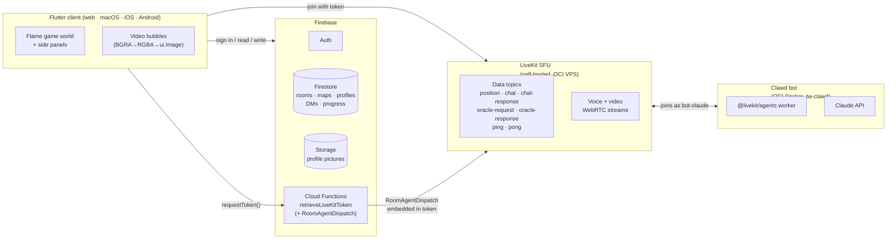
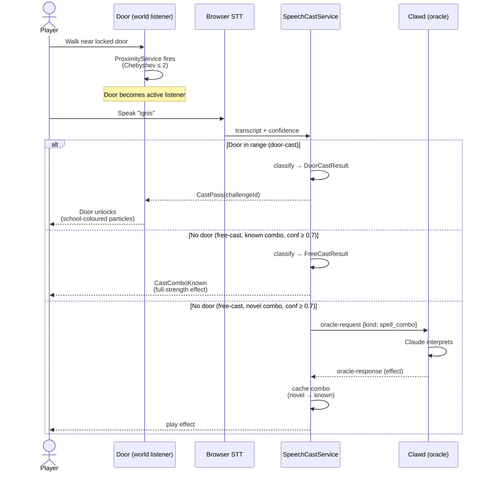

# Tech World

An educational multiplayer 2D virtual world where players solve coding challenges together. Built with Flutter and the Flame game engine, Tech World combines real-time collaboration, proximity-based video chat, an AI tutor (Clawd), and an in-game code editor to create an engaging learn-to-code experience.

## Features

### Multiplayer & Social
- **Room browser / lobby** — Browse and join public rooms or create your own, with animated join progress and owner/editor permissions
- **Player-to-player DMs** — Private direct messages delivered via targeted LiveKit data channels and persisted to Firestore
- **Proximity-based video chat** — LiveKit video/audio streams rendered as in-game bubbles. Proximity is computed with Chebyshev distance (max of |Δx|, |Δy|) so diagonals count the same as cardinals; default threshold is 3 grid squares
- **Dreamfinder presence** — An optional embodied AI participant rendered as a Three.js avatar in an iframe. The iframe canvas is captured per-frame, decoded via `decodeImageFromPixels`, and drawn into the Flame world as a video bubble — same pipeline as remote players
- **User profiles** — Set a display name and upload a profile picture, stored in Firestore and Firebase Storage

### Game World
- **6 predefined maps** — Open Arena, The L-Room, Four Corners, Simple Maze, The Library, The Workshop — with runtime switching
- **Animated tiles** — Water and other terrain tiles animate via shared tickers while static tiles stay in a cached `Picture`
- **Wall occlusion** — Characters walk behind walls and object tiles using y-priority sprite overlays
- **Cross-platform** — macOS, web, iOS, Android

### Map Editor
- **Paint custom maps** — Place tiles on a 50×50 grid with layer-aware palette (floor, structure, objects)
- **Auto-barriers** — Painting solid object tiles automatically places movement barriers
- **Automapping rules engine** — Declarative rules auto-place decorative tiles (shadows, transitions) based on neighbors
- **TMX import** — Import maps from the Tiled map editor (`.tmx` format)
- **Save / load / delete** — Persist custom maps to Firestore, browse them in the lobby
- **Procedural generation** — Generate maps using BSP dungeon, recursive-backtracker maze, or cellular-automata cave algorithms

### Spellbook & Voice Casting
- **18 words of power** — A closed vocabulary of spells (`lumen`, `ignis`, `tempus`, `oraculum` …) that players speak aloud or type to interact with the game world. Each word maps 1:1 to a prompt challenge — solving the challenge teaches the word, after which it's freely reusable
- **Voice spellcasting** — Browser Speech-to-Text captures speech; a `{known, novel} × {high, low}` confidence lattice classifies each cast (table below); doors open, effects fire, or the oracle is invoked depending on the result. Web only
- **Wizard's Tower locked doors** — Doors carry a `requiredWords` list; speaking the word(s) within proximity unlocks them. The new "world is the listener" model treats the door as the active listener — the player has no casting button to press
- **Spell algebra** — Multiple words combine into compound spells. Order-independent canonical `ComboKey` (sorted, comma-joined wire names — `ignis,lumen` and `lumen,ignis` collapse to the same key). 25+ predefined combinations; novel combos route to Clawd for interpretation and are cached
- **Sealed result types** — `DoorCastResult` (door context) and `FreeCastResult` (no door context) are disjoint sealed hierarchies. The compiler proves routing correctness — the door overlay can't be handed a `CastComboNovel`, the free-cast UI can't be handed a `CastWrongDoor`

### Coding & AI
- **23 coding challenges** — Beginner (10), Intermediate (7), and Advanced (6) tiers with LSP-powered code completion and hover docs, powered by [`code_forge_web`](https://github.com/nickmeinhold/code_forge_web) — a custom Flutter web code editor with [`re_highlight`](https://pub.dev/packages/re_highlight) syntax highlighting
- **AI tutor (Clawd)** — Claude-powered bot that reviews code, answers questions, and serves as the game's spell oracle — interpreting cast intent and routing novel combinations
- **Oracle channel** — Generic `oracle-request` / `oracle-response` LiveKit topics with a `kind` discriminator; spell interpretation and future AI features share the same channel

## Prerequisites

- Flutter SDK ^3.6.0
- Firebase project configured (Auth, Firestore, Storage, Cloud Functions)

## Setup

1. Install dependencies:

   ```bash
   flutter pub get
   ```

2. Create Firebase configuration at `lib/firebase/firebase_config.dart`:

   ```dart
   const firebaseWebApiKey = '<your_web_api_key>';
   const firebaseProjectId = '<your_project_id>';
   ```

3. Configure Firebase options via FlutterFire CLI or manually create `lib/firebase_options.dart`.

## Running

```bash
flutter run -d macos   # or chrome, ios, android
```

## Testing

```bash
flutter test                          # Run all tests
flutter analyze --fatal-infos         # Static analysis (CI requirement)
```

CI runs analysis then tests with coverage. The merge-to-main threshold is 45%. See `CLAUDE.md` for details.

## Architecture

The app uses a service locator pattern (`Locator`) and Flame's component system. Real-time communication (player positions, chat, video/audio) goes through LiveKit. Persistent data (rooms, maps, DM history, user profiles) lives in Firestore and Firebase Storage. **There is no separate game server** — clients reconcile state via LiveKit data channels and Firestore listeners.

### System



Token-based agent dispatch ensures the bot joins regardless of whether the room is new or already exists — LiveKit's automatic dispatch only fires for new rooms, which fails when rooms persist between sessions.

### Casting flow



### Confidence lattice (free-cast only)

Every voice cast carries a confidence score from the browser STT. The classifier maps it onto a 2×2 lattice:

| | confidence ≥ 0.7 | 0.3 ≤ confidence < 0.7 |
|---|---|---|
| **Known combo** | `CastComboKnown` — full-strength effect | `CastComboKnownPartial` — half-strength, visibly wavering |
| **Novel combo** | `CastComboNovel` — sent to Clawd oracle for interpretation, result cached | `FreeCastNoMatch` — flavor text ("the words swirl…"), no oracle round-trip |

Confidence below `0.3` (the noise floor) is dropped silently — distinguishes "STT picked up background noise" from "player intentionally cast something we don't understand."

For detailed architecture, component descriptions, and development notes, see [`CLAUDE.md`](CLAUDE.md) and [`docs/architecture-reference.md`](docs/architecture-reference.md).

## Related Projects

| Project | Description |
|---------|-------------|
| `tech_world_bot/` | AI tutor (Clawd) — Node.js using `@livekit/agents` + Claude API |
| `tech_world_firebase_functions/` | Firebase Cloud Functions for LiveKit token generation |

## Demo / Screenshots

<!-- TODO: Add screenshots and demo video for grant assessors -->

## Grant Application

Application materials for the Screen Australia Games Production Fund are in [`docs/grant-application/`](docs/grant-application/).

## License

See repository root.
